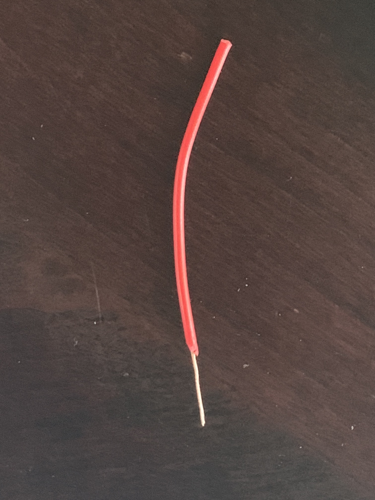
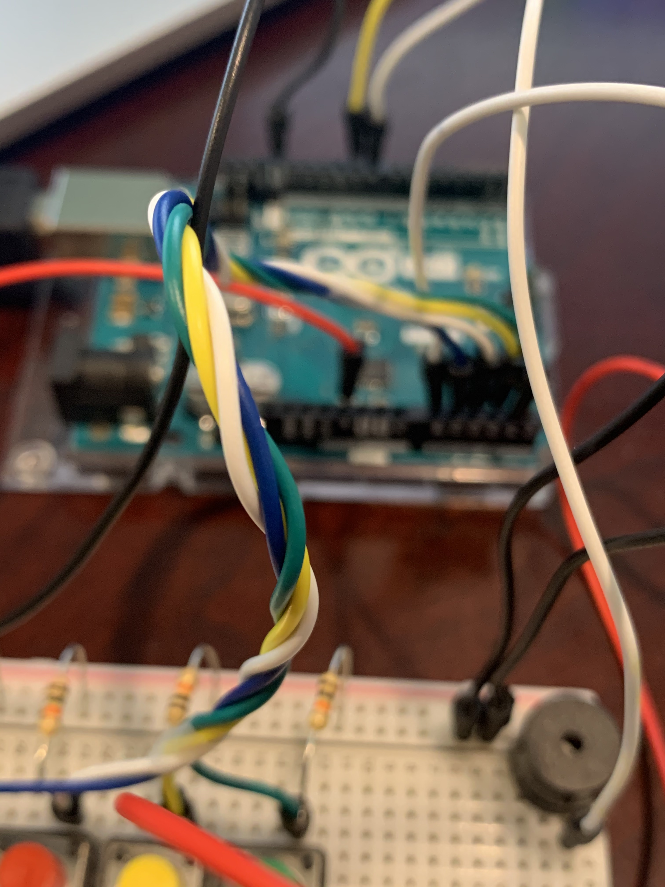
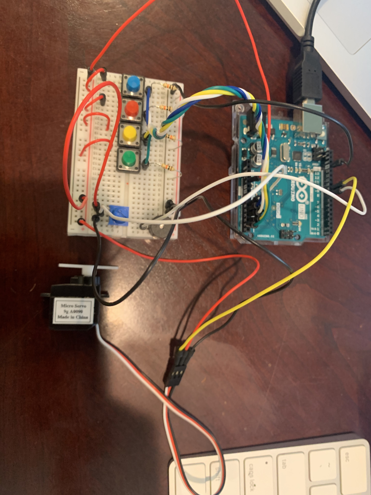
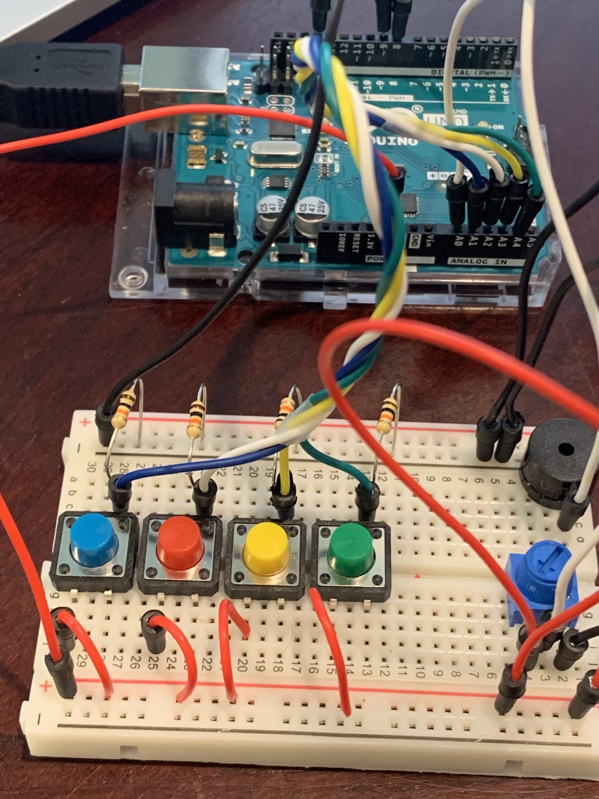

# Musical Instrument

**Description**

To use the musical instrument, press the 4 buttons to play different notes and use the potentiometer to control the speed of the servo motor for the beat.

**Solutions**

I utilized various techniques in order to make the musical instrument less clutterred and easier to play for the user. One of the main things I focused on was wire management. I cut a red wire into 4 smaller wires and stripped their ends so that I would not have to used 4 large red wires for the buttons. I also braided the analog input wires together so They wouldn't overlap each other and cause problems for the user. This was a technique I used for wire management for multiple wires connecting to adjacent ports in my high school robotics team.

Image of the cut and stripped wire

Image of the braided analog input wires

**Problems**

I had originally tried to attach an item to the end of the servo, but I realized that when the item contacted the surface, the sound was very minor. So I removed it and used the bare servo horns. Additionally, I also had a lot of difficulty stripping the wires because I do not have wire strippers at home. Thus, I resorted to scissors and experienced several failures before finally stripping the wires succesfully.

**Schematic**

**Instrument**

