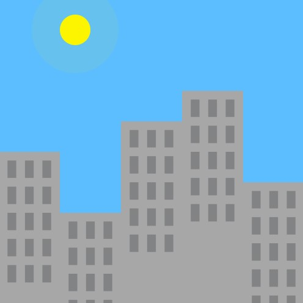
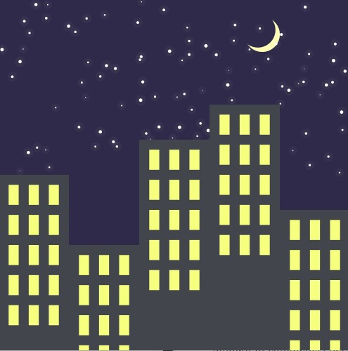

Day

Night

My inspiration for this project was a city skyline. I wanted to create something that resembled a timelapse of a city's skyline. I also remember watching [this video](https://www.youtube.com/watch?v=GjXbxG8YRKw) on youtube about a man who was shooting a 30 year timelapse of New York city. I thought that was realy interesting and I found it fascinating how much a city can change in a span of just 24 hours. 

I wanted my artwork to be scalable. Essentially, I wanted it to function and scale regardless of the canvas size. Consequently, all my variables are interms of the width or height of the canvas. Additionally, I wanted all of the windows in the building to be uniform and spaced out evenly. When the mouse is clicked the animation changes from day to night or night to day.

I used a nested for loop in order to create the windows and ensure that they were all spaced evenly. Additionally, I also used Perlin noise in order to create a glowing effect for the sun and the stars. This created a really cool flickering effect that enhanced the artwork. I had many lines of code in my draw() function so I used other functions in order to clean it up and make it readable. I also used variable names that were easy to understand and this reduced the amount of comments I needed to us.
