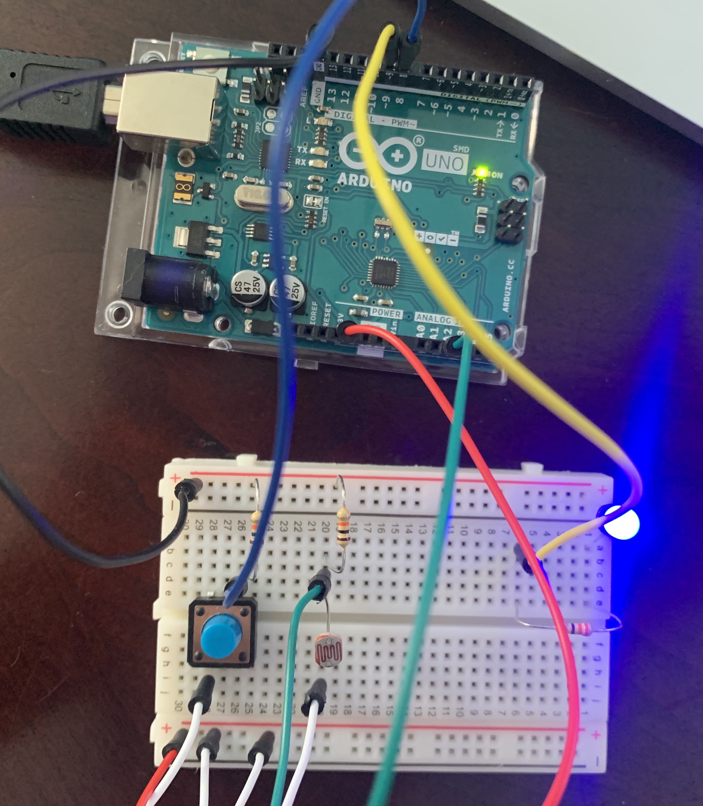
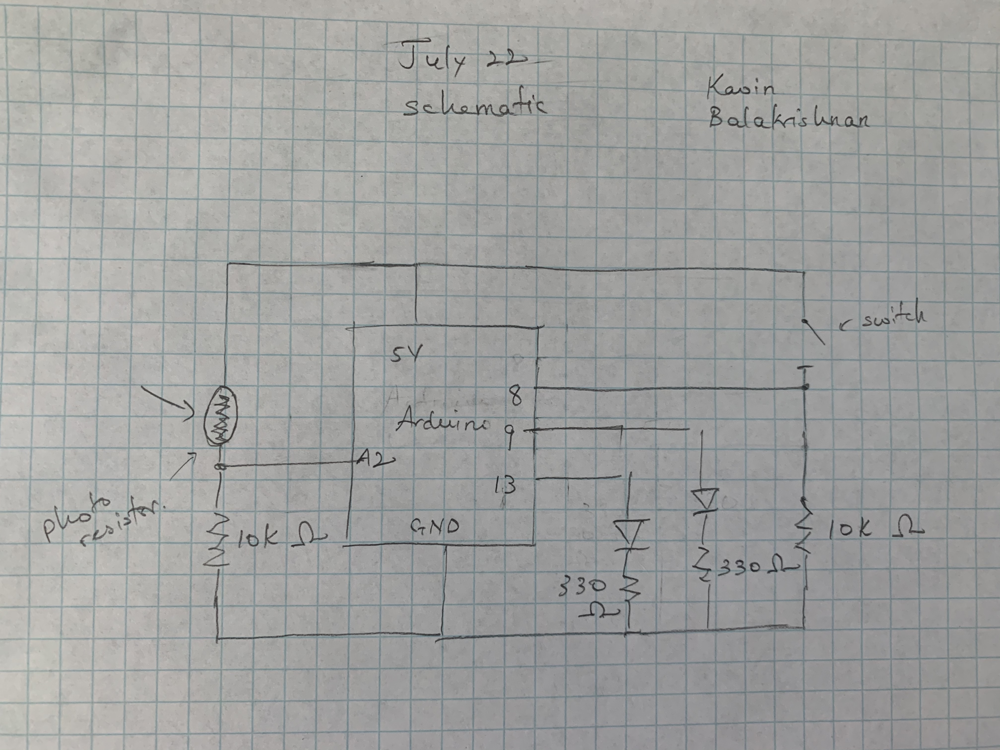

# Digital and Analog Input/Outputs

**Arduino and Breadboard**

**Schematic**

**Description**

I used the photoresistor to control the analog output (the blue LED). The value of the sensor would be mapped on a range specific to the LED. The LED will then dim or brighten according to the corresponding mapped value. By placing your finger atop of the photoresistor, the LED will become dim since the values read from the resistor are low, which corresponds to a low mapped value for the analog output pin (the pin which controls the LED).

The switch controls the built in LED in the arduino. 
