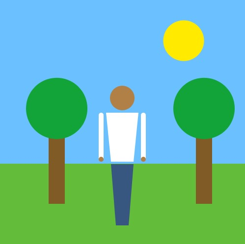

# Self Portrait

**Description and Personal Significance**

The environment depicted in my self portrait is the park. The park is a daily aspect of my life and is a place where I feel comfortable and at peace especially when I am with my friends. During this lockdown, I try to go to the park everyday either to relax or spend time with my friends.

**Description of Difficulties**

One of the difficulties that I encountered was trying to ensure that all the parameters and variables were in terms of the width and the height of the canvas. I wanted the artwork to be scalable, meaning that if the size of the canvas was altered, it would retain its proportions.

Something cool I discovered was the ability to define colors in terms of hex values and initialize them as a pallette at the top of the program. This limits the use of arbitrary, "magic" numbers for various colors.
