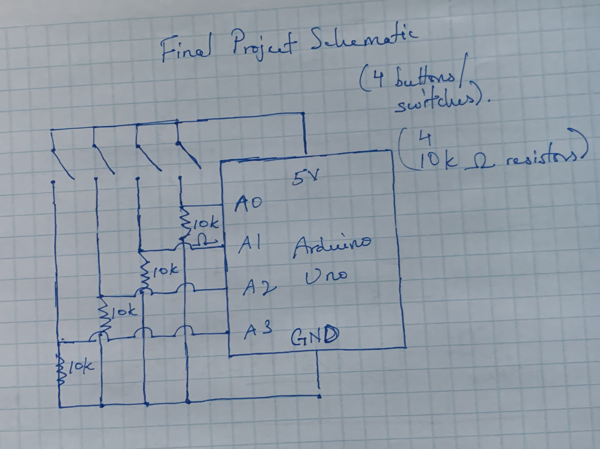
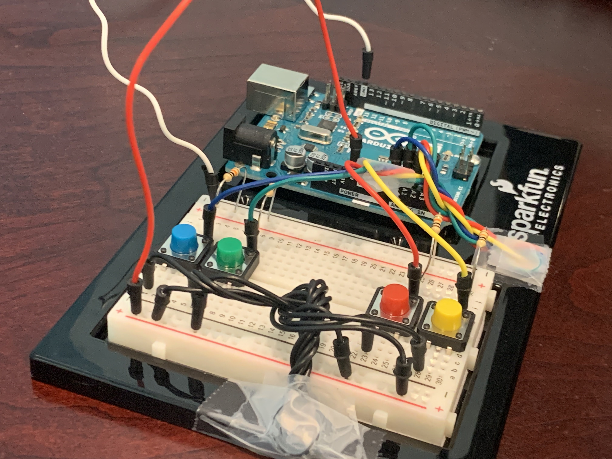
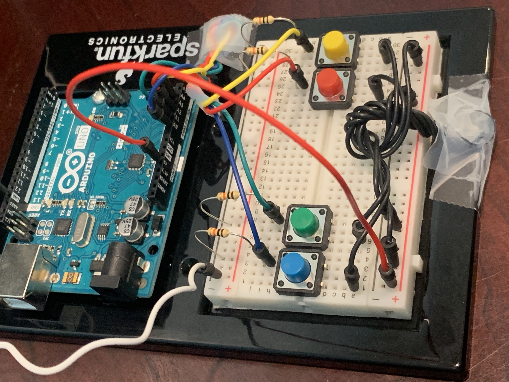
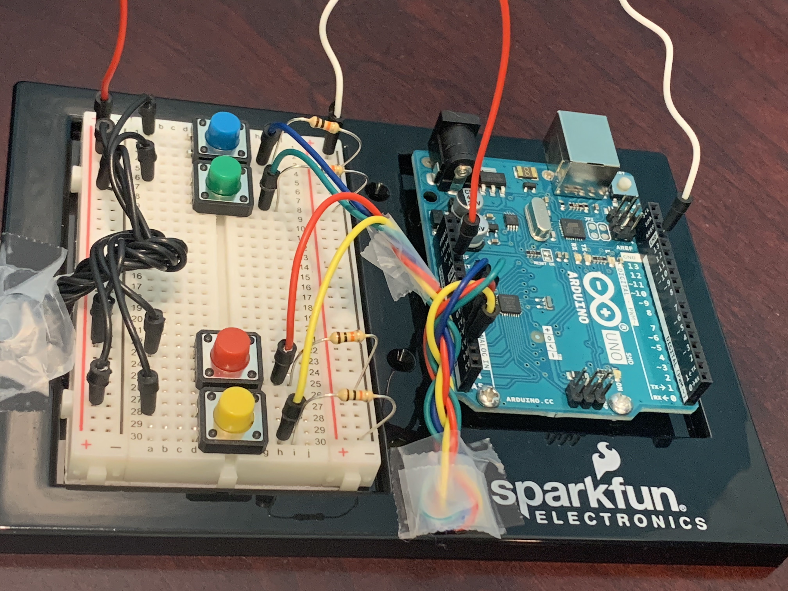
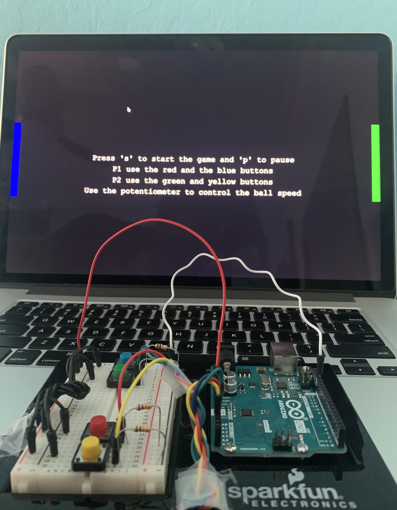

# Final Project
**Description**

For my final project I decided to build upon my pong game. My initial pong game was single player and involved using keyboard inputs to control the paddle. For the final, I succesfully created a multiplayer implementation that can be played by 2 people. Additionally, instead of using keyboard inputs to control the paddles, I utilized serial communication between the arduino and Processing. Consequently, the paddles can be controlled by buttons connected to the Arduino. I built upon the state machine that I had previously used to create multiple game states (start screen, game, and end screen).

**Problems**

1. The first problem I encountered was with implementing multiplayer as I was unable to get the second paddle to work without breaking. I fixed this by creating a new Paddle class and defining functions within them to control the behavior of the paddles.
2. The second problem I had was sending values over the Serial port. The digitalRead() function was not working and it did not print any values to the Serial when the button was pressed. I connected all the buttons to analog pins (A0 through A3) and used the analogRead() function instead. This printed values from 0 to 1023, so in Processing I used a conditional statement to determine if the button was being pressed if the value was not equal to 0.
3. I also ran into an electrical problem with the wiring. 2 of my wires connected to the buttons were not working. So after hours of experimentaion and debugging I determined that the issue had to be the wires and I replaced them.

**Schematic**

**Photographs**

**Video**
